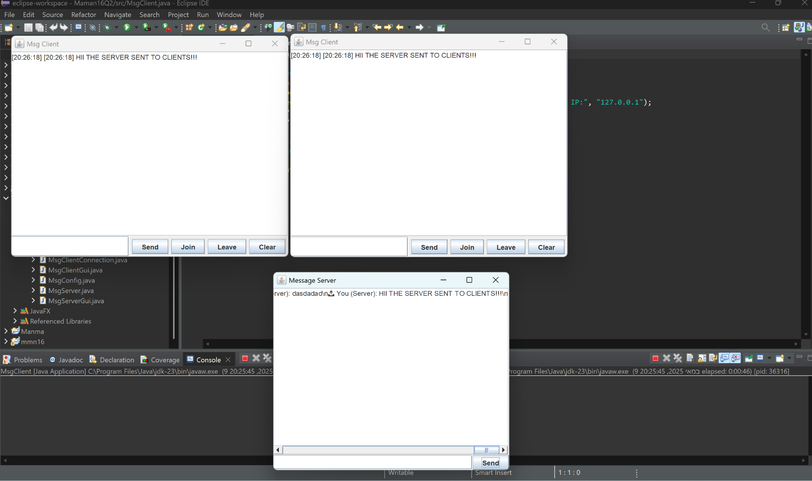

# 📨 UDP Broadcast Chat Server

This project implements a UDP-based message server and clients that can broadcast messages to each other.

## Features
- 📡 **Message Server GUI**
  - Listens on a chosen port
  - Allows sending messages to all connected clients
  - Shows server log
- 💬 **Client GUI**
  - Connects to server via IP & port
  - Can send/receive messages
  - Shows timestamp on each message
  - Join/Leave/Clear buttons

## How to Run (Eclipse)
1. Extract all files into your Eclipse workspace
2. Create a new Java project and import all `.java` files
3. Run `MsgServer.java` to open the server GUI
4. Run `MsgClient.java` (one or more times) to open clients

## Notes
- Uses UDP via `DatagramSocket`
- All clients see broadcasts in real time
- Server and clients must agree on the same port